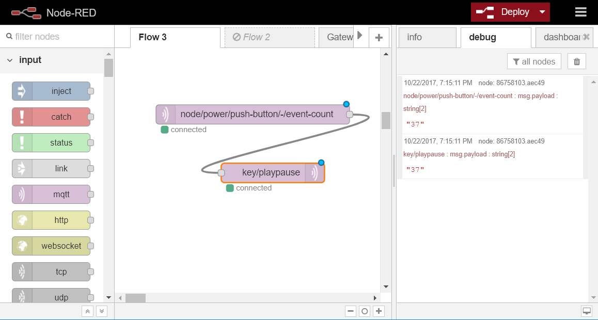

# bc-presenter-pyautogui
This script is listening on MQTT for specific messages and is pressing buttons with pyautogui.

This can be used to control volume by BigClown button kits, or create a simple slideshow presenter
Author: Martin Hubacek

Example mqtt messages (the payload is ignored)
  - key/volumemute
  - key/right

